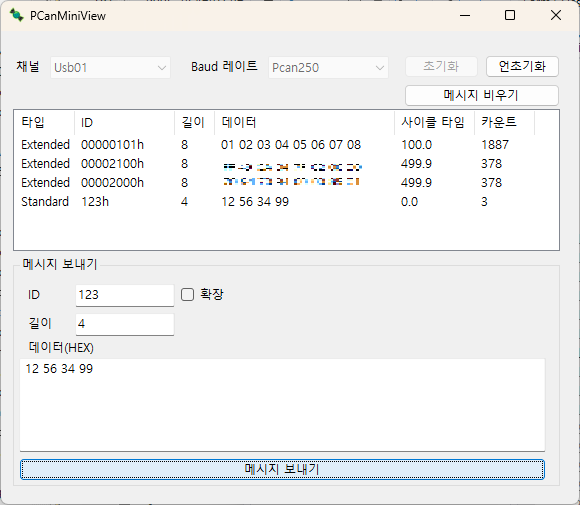

# PCanMiniView



이 프로젝트는 **PCAN 장치**를 통해 **CAN 통신**을 수행하는 Windows Form 응용 프로그램입니다.  
`PCANBasic.NET` 라이브러리를 사용하여 CAN 데이터 송수신을 구현했습니다. 
이 문서는 프로젝트의 설치 및 사용법을 안내합니다.

---

## 📋 목차

1. [프로젝트 소개](#프로젝트-소개)  
2. [설치 요구 사항](#설치-요구-사항)  
3. [프로젝트 설정 및 실행](#프로젝트-설정-및-실행)  
4. [기능 설명](#기능-설명)  
5. [PCANBasic.NET 라이브러리 사용](#PCANBasic.NET-라이브러리-사용)  
6. [에러 및 문제 해결](#에러-및-문제-해결)  
7. [라이선스](#라이선스)  

---

## 1. 프로젝트 소개

이 프로젝트는 C#의 **Windows Form**을 이용해 **CAN 버스 네트워크**에서 데이터를 송수신할 수 있는 프로그램입니다. 사용자는 **PCAN 장치**를 통해 차량 또는 임베디드 장치와 통신할 수 있으며, 메시지를 주고받으며 실시간으로 모니터링할 수 있습니다.

주요 기능:
- **CAN 메시지 송신 및 수신**  
- 송신 메시지의 **ID, 데이터 필드, 속도** 설정  
- **CAN 메시지 로그** 및 저장  
- **PCAN 장치 상태 확인** 및 오류 메시지 표시  

---

## 2. 설치 요구 사항

아래 요구 사항을 만족해야 정상적으로 프로그램을 실행할 수 있습니다:

- **Windows 10/11** 이상
- **.NET Framework 4.8** 이상 설치
- **PCAN 장치** (예: PCAN-USB, PCAN-PCI 등)  
- **PCANBasic.NET** 라이브러리 (NuGet에서 설치)  
- Visual Studio 2022 이상 (권장)

---

## 3. 프로젝트 설정 및 실행

1. **PCAN 장치 드라이버 설치**  
   PCAN 장치를 사용하기 전, [PEAK-System](https://www.peak-system.com) 웹사이트에서 **PCAN 드라이버**를 다운로드하고 설치합니다.

2. **PCANBasic.NET 설치**  
   Visual Studio에서 `NuGet Package Manager`를 열고 다음 명령으로 PCANBasic.NET 라이브러리를 설치합니다:
   ```bash
   Install-Package Peak.PCANBasic.NET
   ```

   또는

   개발자 터미널에서 다음 명령을 실행합니다:
   ```bash
   dotnet add package Peak.PCANBasic.NET --version 4.9.0.942
   ```

3. **프로젝트 빌드**  
   Visual Studio에서 프로젝트를 열고 `빌드(Build)`를 클릭하여 컴파일합니다.

4. **PCAN 장치 연결**  
   PCAN-USB 또는 다른 PCAN 장치를 PC에 연결합니다.

5. **프로그램 실행**  
   Windows Form 응용 프로그램을 실행하고, 올바른 **채널(Channel)** 과 **보레이트(Baud Rate)** 를 선택합니다.

---

## 4. 기능 설명

| 기능                | 설명                                                       |
|--------------------|------------------------------------------------------------|
| **CAN 송신**       | 사용자가 입력한 메시지를 지정한 ID로 송신합니다.            |
| **CAN 수신**       | 연결된 PCAN 장치로부터 실시간으로 CAN 메시지를 수신합니다.  |
| **로그 기록**      | 송수신된 메시지를 리스트로 보여줍니다. |


---

## 5. PCANBasic.NET 라이브러리 사용

이 프로젝트는 **PCANBasic.NET** 라이브러리를 사용하여 CAN 통신을 수행합니다.


---

## 6. 에러 및 문제 해결

1. **PCAN 장치가 인식되지 않을 때**  
   - 장치 관리자(Device Manager)에서 PCAN 장치가 정상적으로 설치되었는지 확인합니다.  
   - 드라이버를 다시 설치해 보세요.

2. **CAN 메시지가 송신되지 않을 때**  
   - 올바른 채널과 비트레이트 설정이 되어 있는지 확인합니다.  
   - 장치가 이미 사용 중인 경우 프로그램을 종료 후 다시 실행합니다.

3. **PCANBasic.NET 관련 오류**  
   - NuGet 패키지가 제대로 설치되었는지 확인합니다.  
   - 패키지 의존성을 최신 버전으로 업데이트합니다.

---

## 7. 라이선스

이 프로젝트는 MIT 라이선스를 따르며, **PCANBasic.NET 라이브러리**(© PEAK-System)의 사용이 포함됩니다.  
PCANBasic.NET은 **PEAK-System**의 하드웨어와 함께 사용할 경우에 한해 무료로 제공됩니다.  
자세한 라이선스 조건은 [PEAK END USER SOFTWARE LICENSE AGREEMENT](https://www.nuget.org/packages/Peak.PCANBasic.NET/4.9.0.942/License)에서 확인할 수 있습니다.


